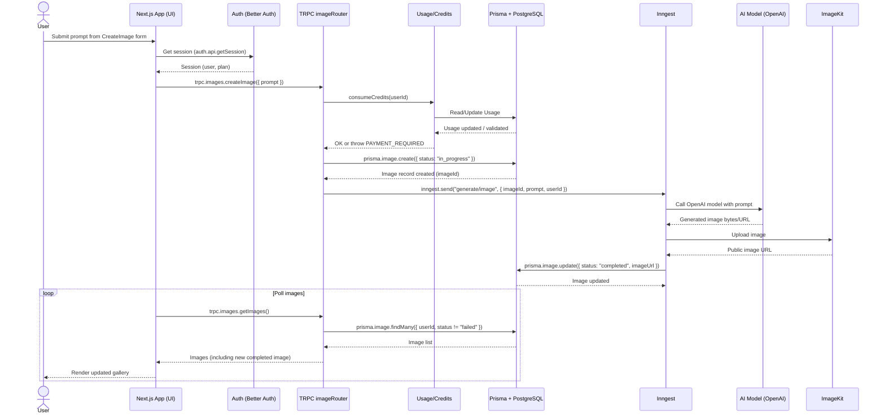
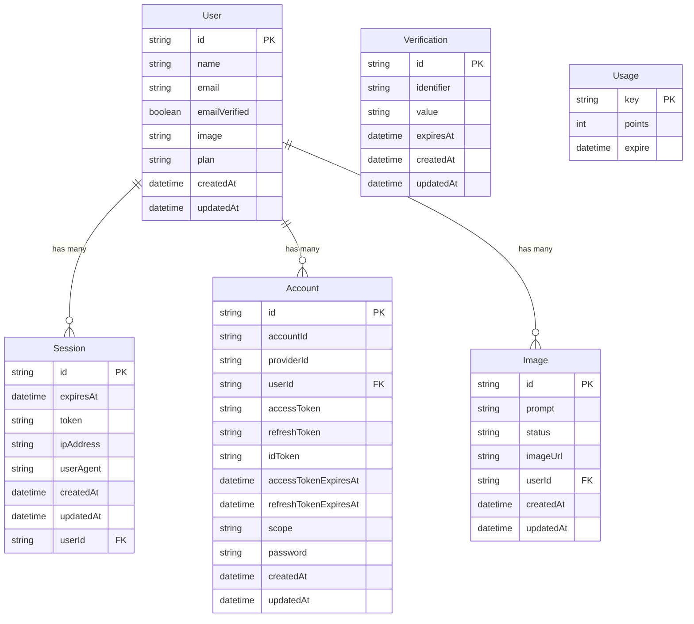

## Image Generation Platform

An AI-powered image generation SaaS built with **Next.js App Router**, **Prisma + PostgreSQL**, **TRPC**, **Inngest**, **OpenAI (via `ai` / `@ai-sdk/openai`)**, **ImageKit**, and **Better Auth + Polar** for authentication and billing.

### Overview

This application lets authenticated users generate images from text prompts, view their generated images, and manage them within a modern, responsive dashboard. Usage is gated by a credit/plan system (free, pro, gold) integrated with Polar subscriptions, and image processing is handled asynchronously via Inngest jobs and stored via ImageKit.

### Features

- **User authentication & sessions**
  - Email/password authentication using `better-auth` and Prisma adapter.
  - Session management and secure, server-side session retrieval in the Next.js App Router.
- **Subscription & billing**
  - Polar integration for paid plans (e.g., **DALL-E Pro Plan**, **DALL-E Gold Plan**).
  - Webhooks to automatically upgrade/downgrade user plans in the database.
- **AI image generation**
  - Prompt-based image generation using the `ai` SDK and OpenAI models (DALL·E style).
  - Asynchronous processing with Inngest background functions.
  - Image storage and delivery via `imagekit`.
- **Per-user image management**
  - Create, list, and delete images via TRPC procedures.
  - Client-side React Query integration for fetching and caching image lists.
- **Usage limits & credits**
  - Daily / plan-based credit checks via a `Usage` model and `consumeCredits` utility.
  - Server-side enforcement with proper TRPC error handling (`PAYMENT_REQUIRED`).
- **Modern UI & DX**
  - Next.js App Router with layouts and route groups.
  - Tailwind CSS v4 + shadcn-style UI components (buttons, cards, inputs, dialogs, etc.).
  - Skeletons, spinners, and shimmer effects for better loading UX.

---

### Tech Stack

- **Framework**
  - **Next.js 16** (App Router)
  - **React 19**
- **Backend & API**
  - **TRPC 11** for type-safe API routing (`imageRouter`, `appRouter`).
  - **Inngest 3** for background jobs (image generation pipeline).
  - **Better Auth** for authentication and session management.
  - **Polar** for billing, checkout, customer portal, and webhooks.
- **Database & ORM**
  - **PostgreSQL** (via `pg`)
  - **Prisma 7** with generated client in `src/generated/prisma`
- **AI & Media**
  - **OpenAI** via `ai` + `@ai-sdk/openai`
  - **ImageKit** for image storage and CDN
- **Frontend**
  - **Tailwind CSS 4** + `tailwind-merge`
  - **shadcn-style UI components** (buttons, cards, dialogs, sheets, sidebars, etc.)
  - **Lucide-react** icons, `motion` for animations
  - **@tanstack/react-query`** for data fetching & caching
- **Validation & Forms**
  - **Zod** for schema validation
  - **React Hook Form** + `@hookform/resolvers`
- **Tooling**
  - **TypeScript 5**
  - **ESLint 9** + `eslint-config-next`
  - **Prisma Migrations**

---

### System Architecture

At a high level, the system consists of:

- **Web Client (Next.js App Router)**
- **Auth & Billing**
  - Better Auth + Prisma
  - Polar for subscriptions & webhooks
- **Application Backend**
  - TRPC router (`imageRouter`) for image CRUD and usage checks
  - Prisma ORM talking to PostgreSQL
- **Async Workers**
  - Inngest functions listening for `generate/image` events
  - AI model + ImageKit integration
- **Storage**
  - PostgreSQL for users, sessions, accounts, images, usage
  - ImageKit for the actual image assets

---

### Core Database Models (Prisma)

From `prisma/schema.prisma`:

- **User**
  - Basic profile (`id`, `name`, `email`, `image`, timestamps)
  - `plan` field: `"free_user" | "pro_user" | "gold_user"`
  - Relations: `sessions`, `accounts`, `images`
- **Session**
  - Session token, expiry, IP, user agent, and `userId` FK → `User`
- **Account**
  - OAuth/account linkage (`providerId`, `accountId`, tokens) with `userId` FK → `User`
- **Verification**
  - Email / verification tokens
- **Image**
  - `id`, `prompt`, `status`, `imageUrl`, `userId`, timestamps
- **Usage**
  - `key`, `points`, `expire` for tracking usage/credits

---

### Mermaid Diagrams

#### Sequence Diagram – Image Generation Flow



#### ER Diagram – Core Data Model



```mermaid
flowchart LR
    subgraph Client
      U[User Browser<br/>Next.js App Router]
    end

    subgraph Backend
      API[TRPC API<br/>(imageRouter, appRouter)]
      AUTH[Better Auth<br/>Next.js handler]
      BLL[Usage & Business Logic<br/>(consumeCredits, plan checks)]
    end

    subgraph Async
      INN[Inngest Worker<br/>generate/image]
      AI[AI Model<br/>(OpenAI via ai-sdk)]
      IK[ImageKit<br/>CDN & Storage]
    end

    subgraph Data
      DB[(PostgreSQL<br/>Prisma Models)]
      POLAR[Polar<br/>Billing & Webhooks]
    end

    U -->|Login / Register| AUTH
    AUTH --> DB
    POLAR --> AUTH
    POLAR -->|Webhooks: order paid / subscription revoked| DB

    U -->|Create prompt / View images| API
    API --> AUTH
    API --> BLL
    BLL --> DB
    API --> DB

    API -->|send event| INN
    INN --> AI
    AI --> INN
    INN --> IK
    IK --> INN
    INN --> DB

    U <-->|React Query (TRPC)| API
    U -->|Loads images via ImageKit URLs| IK
```

---

### Project Structure (High Level)

- `src/app`
  - `layout.tsx` – Root layout
  - `(auth)/login`, `(auth)/register` – Auth pages
  - `(routes)/page.tsx` – Authenticated home (image generation & gallery)
  - `api/auth/[...all]/route.ts` – Better Auth handlers
  - `api/trpc/[trpc]/route.ts` – TRPC fetch handler
  - `api/inngest/route.ts` – Inngest handler
- `src/backend`
  - `init.ts` – TRPC init (`createTRPCRouter`, `protectedProcedure`, context)
  - `routers/_app.ts` – Root TRPC router including `imageRouter`
  - `server.tsx`, `client.tsx`, `query-client.ts` – TRPC + React Query setup
- `src/modules/images`
  - `components/create-image.tsx`, `view-images.tsx` – UI for prompts & gallery
  - `server/procedures.ts` – `imageRouter` TRPC procedures
- `src/lib`
  - `auth/auth.ts` – Better Auth configuration + Polar plugin
  - `prisma.ts` – Prisma client
  - `utils.ts` – Shared helpers
- `src/ingngest`
  - `client.ts` – Inngest client
  - `functions/*` – Image generation & health-check workers
- `src/utils`
  - `imagekit.ts` – ImageKit client
  - `usage.ts` – Usage / credits logic
- `prisma`
  - `schema.prisma` – Database schema
  - `migrations/*` – Prisma migrations

---

### Getting Started

- **Prerequisites**
  - Node.js (matching the version supported by Next.js 16)
  - PNPM (recommended, see `pnpm-lock.yaml`)
  - PostgreSQL database

- **Installation**
  1. Clone the repository.
  2. Install dependencies:
     ```bash
     pnpm install
     ```
  3. Set up your `.env` file (see Environment Variables below).
  4. Run Prisma migrations:
     ```bash
     pnpm prisma migrate deploy
     ```
  5. Start the dev server:
     ```bash
     pnpm dev
     ```

---

### Environment Variables (Overview)

The following environment variables are used (names based on the codebase; ensure they exist in your `.env`):

- **Database / Prisma**
  - `DATABASE_URL` – PostgreSQL connection string (used by Prisma).
- **Auth / Better Auth / Polar**
  - `POLAR_ACCESS_TOKEN` – Polar API token.
  - `POLAR_WEBHOOK_SECRET` – Secret for verifying Polar webhooks.
- **ImageKit**
  - `IMAGEKIT_PUBLIC_KEY`
  - `IMAGEKIT_PRIVATE_KEY`
  - `IMAGEKIT_URL_ENDPOINT`
- **OpenAI / AI SDK**
  - `OPENAI_API_KEY` (or equivalent key used by the `ai` SDK).

You may have additional keys for Next.js, Inngest, and other integrations; refer to the codebase and deployment environment for the complete list.

---

### Development Notes

- Use `pnpm lint` to run ESLint checks.
- TRPC procedures are fully type-safe; update `imageRouter` and `appRouter` to expose new backend functionality.
- For schema changes, update `prisma/schema.prisma`, run `prisma migrate`, and regenerate the Prisma client if necessary.

